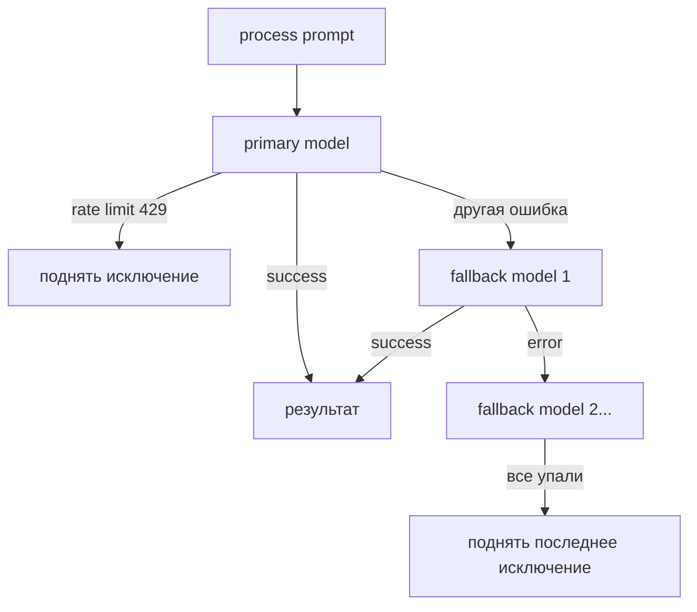

# AI

`src/backend/core/ai.py` — централизованный AI-сервис на базе Google Gemini через `codex_ai`.

## AIService

Единственная точка входа для AI-операций в проекте. Хранится в `app.state.ai`.

```python
result = await app.state.ai.process("world_generate", location_id=loc_id, theme=theme)
```

Если `GEMINI_API_KEY` не задан — `dispatcher=None`, все вызовы `process()` возвращают `None` без ошибки.

## FilteringGeminiProvider

Кастомный провайдер поверх `GeminiProvider`. Решает две проблемы:

**1. Фильтрация kwargs** — `codex_ai` передаёт в провайдер все kwargs из prompt-builder, включая не-Gemini поля. `FilteringGeminiProvider` пропускает только разрешённые: `model`, `temperature`, `max_tokens`, `top_p`, `top_k` и т.д.

**2. Fallback модели** — если основная модель падает (не rate limit, не явная перегрузка) — последовательно пробует `gemini_fallback_models` из settings.



`_normalize_prompt` — system-сообщения из `messages[]` вытаскиваются и объединяются в единый `system` field (Gemini требует system отдельно от user-messages).
