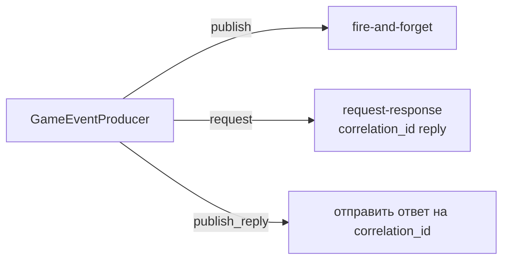

# Bus (Event Bus)

`src/backend/core/bus/` — тонкий адаптер над `codex_platform.streams`. Весь межфичевый обмен событиями идёт через `app.state.events` — экземпляр `GameEventProducer`.

Подробная документация по паттернам publish/request/reply: см. `docs/agent-skills/turnbasedmmorpg-redis-streams/SKILL.md`.

## Два режима

**`publish`** — fire-and-forget с логом. Возвращает `message_id`.

**`request`** — блокирующий вызов с ожиданием ответа по `correlation_id`. Таймаут по умолчанию 30 сек. Использовать когда вызывающий домен должен получить результат синхронно.

**`publish_reply`** — отправить ответ обратно обработчику который делал `request`.

## GameStreamRouter

`GameStreamRouter` — реэкспорт `StreamRouter` из `codex_platform`. Используется в `events/__init__.py` каждой фичи для регистрации handlers.

::: backend.core.bus.producer.GameEventProducer
    options:
      show_source: false
      show_root_heading: false
