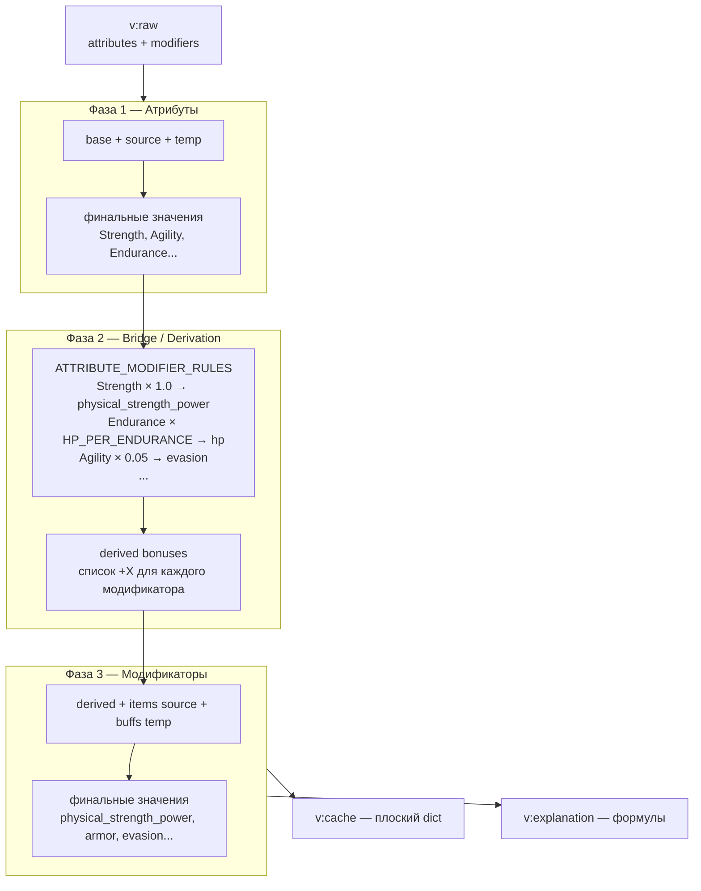

# Calculators

`src/backend/core/calculators/` — математическое ядро игры. Три независимых сервиса.

---

## StatsWaterfallCalculator

Универсальный калькулятор характеристик персонажа. Принимает сырые данные (`v:raw` из Redis) и возвращает финальные значения всех статов + строку-объяснение формулы для каждого.

### Три фазы



### DSL формул

Каждый источник статов это строка-команда:

| Команда | Действие | Пример |
|---------|---------|--------|
| `+X` | Прибавить flat | `+15.0` |
| `-X` | Вычесть flat | `-5` |
| `*X` | Умножить | `*1.25` |
| `=X` | Перезаписать (override) | `=100` |

Итоговая формула собирается как `(flat1 + flat2 + ...) * mult1 * mult2` и вычисляется через безопасный AST-парсер (не `eval`).

### ATTRIBUTE_MODIFIER_RULES

Bridge-правила живут в `src/backend/features/character/runtime/rules/attribute_modifiers.py`. Примеры:

| Атрибут | Модификатор | Коэффициент |
|---------|------------|-------------|
| `strength` | `physical_strength_power` | 1.0 |
| `agility` | `physical_agility_power` | 1.0 |
| `endurance` | `physical_endurance_power` | 1.0 |
| `endurance` | `hp` | HP_PER_ENDURANCE |
| `agility` | `evasion` | 0.05 |
| `agility` | `initiative` | 0.5 |
| `intellect` | `magical_damage` | 1.0 |
| `mental` | `magic_resist` | 0.02 |
| `perception` | `anti_dodge_chance` | 0.03 |

`physical_endurance_power` остается производным полем для боевых расчетов, но
обычный урон оружия теперь собирается только из силы и ловкости. Выносливость
используется для живучести и стилевых механик, например щитового
`shield_guard_power`.

**Публичный API:**

```python
# Полный цикл — возвращает (v:cache, v:explanation)
cache, explanation = StatsWaterfallCalculator.calculate_waterfall(raw_data)

# Только оценка набора источников (можно использовать отдельно)
value, formula = StatsWaterfallCalculator.evaluate_sources(sources, base_value=0.0)
```

::: backend.core.calculators.stats_waterfall_calculator.StatsWaterfallCalculator
    options:
      show_source: false
      show_root_heading: false

---

## ChanceService

Утилитарный сервис для вероятностей. Используется в Combat, Exploration, Loot.

Принимает как проценты (0–100), так и доли (0.0–1.0) — автоматически нормализует.

```python
ChanceService.check_chance(0.45)           # 45% → True/False
ChanceService.weighted_choice({"wolf": 50, "bear": 10})
ChanceService.random_range(1, 20)
```

---

## SkillProgressionCalculator

Калькулятор прогрессии навыков. Определяет скорость набора XP навыка в зависимости от текущего уровня и состояния (`SkillProgressState`).
