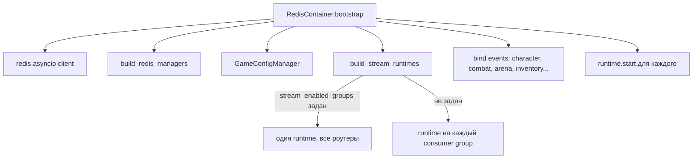

# Containers

`src/backend/core/containers/` — четыре контейнера, каждый отвечает за свою часть инфраструктуры. Все вызываются из `lifespan.py` строго по порядку.

## DatabaseContainer

Поднимает SQLAlchemy async engine и применяет Alembic-миграции.

::: backend.core.containers.database.DatabaseContainer
    options:
      show_source: true
      show_root_heading: false

---

## RedisContainer

Самый сложный контейнер. Инициализирует Redis-клиент, всех Redis-менеджеров, `GameConfigManager`, поднимает Stream Runtimes и биндит event handlers всех features.

Consumer groups при `stream_enabled_groups=None` (дефолт для прода):
`character`, `combat`, `inventory`, `items`, `monsters`, `scenario`, `arena`

::: backend.core.containers.redis.RedisContainer
    options:
      show_source: true
      show_root_heading: false

---

## AIContainer

Инициализирует Google Gemini клиент, кладёт в `app.state.ai`.

::: backend.core.containers.ai.AIContainer
    options:
      show_source: true
      show_root_heading: false

---

## GameFeatureContainer

Бутстрапит данные игрового мира: загружает локации в Redis и импортирует сценарии из JSON-фикстур.

::: backend.core.containers.game.GameFeatureContainer
    options:
      show_source: true
      show_root_heading: false
