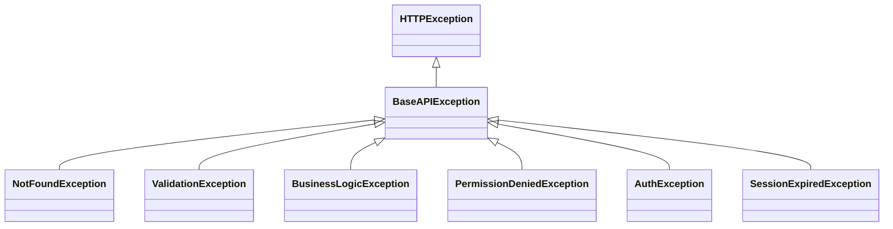

# Exceptions

`src/backend/core/exceptions.py` — иерархия API-исключений и обработчик ответа.

## Иерархия



| Класс | HTTP | error_code |
|-------|------|-----------|
| `NotFoundException` | 404 | `not_found` |
| `ValidationException` | 422 | `validation_error` |
| `BusinessLogicException` | 409 | `business_conflict` |
| `PermissionDeniedException` | 403 | `permission_denied` |
| `AuthException` | 401 | `auth_error` |
| `SessionExpiredException` | 401 | `session_expired` |

## api_exception_handler

Регистрируется в `app.py` как `exception_handler(BaseAPIException)`. Возвращает JSON в формате `shared.schemas.errors.ErrorResponse`:

```json
{"error": {"code": "not_found", "message": "Resource not found"}}
```

`SessionExpiredException` — сигнал фронтенду что Redis-сессия истекла, нужен релогин.
