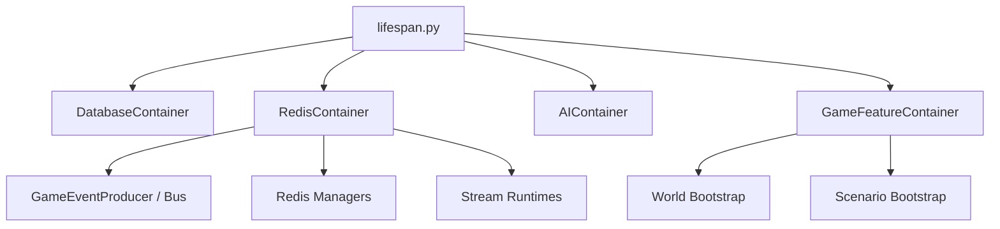

# Core

`src/backend/core/` — инфраструктурное ядро бекенда. Не содержит игровой логики — только фундамент на котором стоят все features.

## Модули

| Модуль | Назначение |
|--------|-----------|
| `lifespan.py` | FastAPI lifespan — порядок старта/стопа всех контейнеров |
| `containers/` | Четыре контейнера: Database, Redis, AI, GameFeature |
| `bus/` | `GameEventProducer` — адаптер Event Bus (Redis Streams) |
| `calculators/` | Waterfall-калькулятор статов, шанс-сервис, прогрессия навыков |
| `database/` | SQLAlchemy сессия, base-модель, импорт всех моделей |
| `arq.py` | ARQ-воркер (фоновые задачи) |
| `ai.py` | Клиент AI (Google Gemini) |
| `schemas/` | Базовые Pydantic-схемы |
| `security.py` | JWT / AuthX |
| `middleware.py` | FastAPI middleware |
| `exceptions.py` | Базовые исключения |
