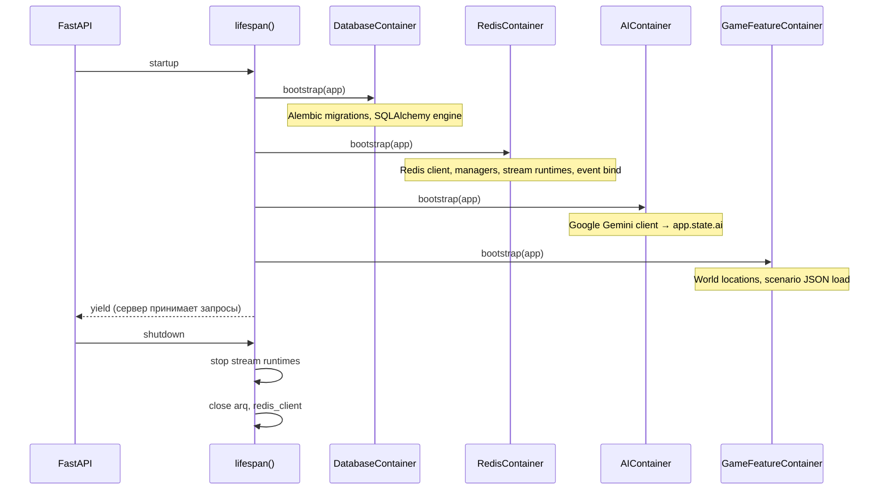

# Lifespan

`src/backend/core/lifespan.py` — FastAPI lifespan context manager. Определяет строгий порядок запуска и остановки всех контейнеров.

## Порядок старта

## app.state после старта

После успешного старта на `app.state` доступны:

| Ключ | Тип | Устанавливает |
|------|-----|---------------|
| `redis_client` | `redis.asyncio.Redis` | RedisContainer |
| `redis` | `RedisService` | RedisContainer |
| `redis_managers` | `RedisManagers` | RedisContainer |
| `events` | `GameEventProducer` | RedisContainer |
| `stream_runtimes` | `list[StreamRuntime]` | RedisContainer |
| `game_config` | `GameConfigManager` | RedisContainer |
| `character_sessions` | manager | RedisContainer |
| `actor_commitments` | manager | RedisContainer |
| `ai` | AI client | AIContainer |
| `world_cache_loaded_count` | `int` | GameFeatureContainer |

`src/backend/core/lifespan.py` — `lifespan(app)` async context manager, передаётся в `FastAPI(lifespan=lifespan)`.
