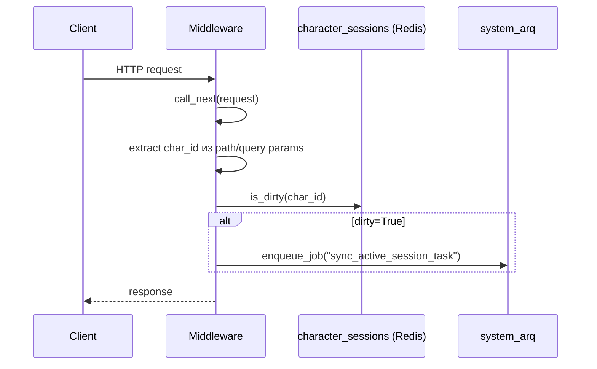

# Middleware

`src/backend/core/middleware.py` — FastAPI middleware бекенда.

## ActiveCharacterDirtySyncMiddleware

После каждого HTTP-запроса проверяет флаг `is_dirty` у character session в Redis. Если персонаж "грязный" (данные изменились но ещё не персистированы в БД) — ставит задачу `sync_active_session_task` в `SYSTEM_ARQ_QUEUE`.

`char_id` извлекается из `path_params` или `query_params` по ключам `char_id` / `character_id`. Если не найден — middleware пропускает синхронизацию без ошибки.

`system_arq` создаётся лениво при первом dirty-запросе и сохраняется в `app.state.system_arq`.
