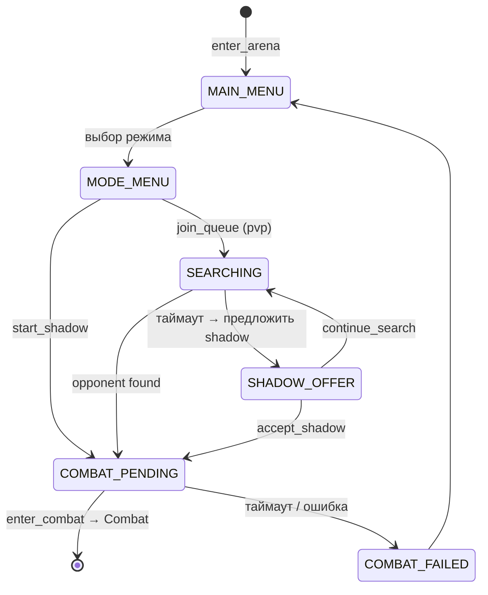
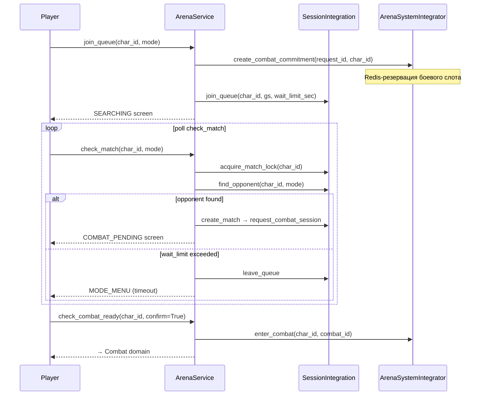

# Arena

`src/backend/features/arena/` — матчмейкинг, рейтинговые бои и тренировки.

## Типы боёв

| Тип | Описание |
|-----|---------|
| `pvp` | Два реальных игрока найденных через очередь |
| `shadow` | Игрок против копии своего персонажа |

## Экраны (ArenaScreenEnum)

## Флоу матчмейкинга (pvp)

## Структура модуля

| Слой | Назначение |
|------|-----------|
| `services/` | Бизнес-логика: матчмейкинг, рейтинг, сезоны, дуэли |
| `integrations/` | Связь с character, combat, stream |
| `runtime/` | ELO-калькулятор, лиги |
| `repositories/` | Redis-хранилище сессий очереди и матчей |
| `gateway/` | WebSocket gateway |
| `dto/` | Внутренние DTO (сессии, матчи, очередь) |
