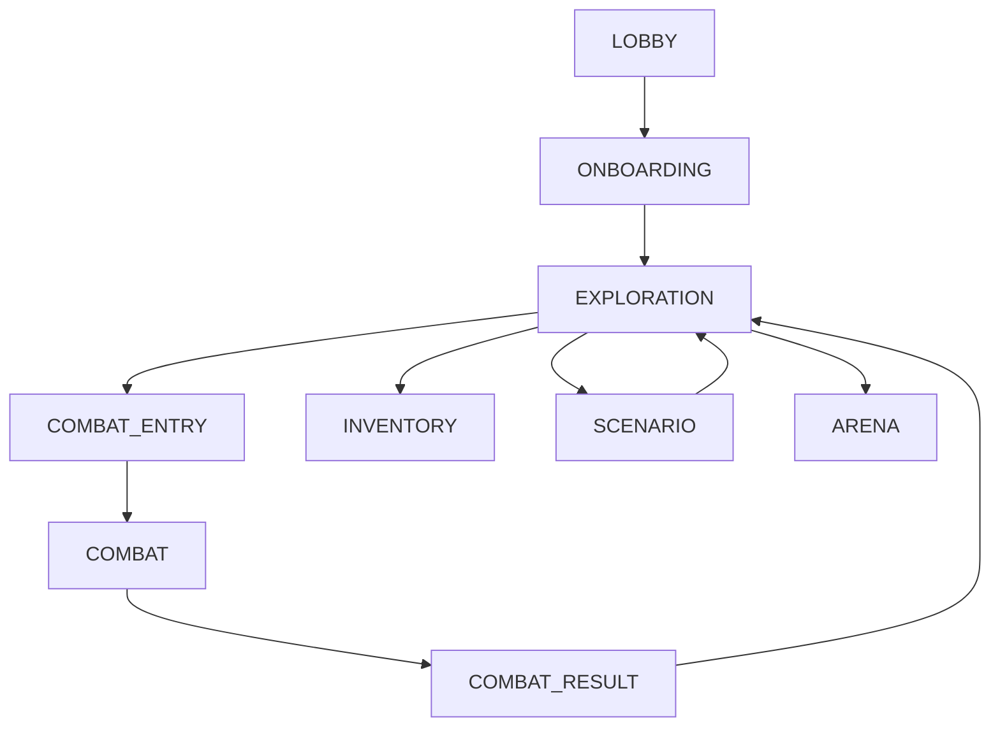

# Enums

`src/shared/enums/` — все StrEnum-перечисления проекта. Используются как бекендом, так и фронтендом как единственный источник истины для строковых констант.

## Домены

`CoreDomain` — реестр всех игровых доменов системы. Используется в `CombatGateway` для маршрутизации, в `AccountContextDTO` для хранения текущего состояния персонажа, и в FSM-переходах.

::: shared.enums.domain_enums.CoreDomain
    options:
      show_source: false
      show_root_heading: false

---

## Предметы

::: shared.enums.item_enums.ItemType
    options:
      show_source: false
      show_root_heading: false

::: shared.enums.item_enums.ItemRarity
    options:
      show_source: false
      show_root_heading: false

::: shared.enums.item_enums.EquippedSlot
    options:
      show_source: false
      show_root_heading: false

::: shared.enums.item_enums.QuickSlot
    options:
      show_source: false
      show_root_heading: false

---

## Инвентарь

::: shared.enums.inventory_enums.InventoryViewTarget
    options:
      show_source: false
      show_root_heading: false

::: shared.enums.inventory_enums.InventoryActionType
    options:
      show_source: false
      show_root_heading: false

::: shared.enums.inventory_enums.InventorySection
    options:
      show_source: false
      show_root_heading: false

---

## Статы персонажа

`StatKey` — ключи всех характеристик персонажа. Используются в формулах урона, Redis-снэпшотах и DTO модификаторов. Три группы: первичные атрибуты (9 базовых), ресурсы (Vitals) и вторичные боевые статы.

::: shared.enums.stats_enums.StatKey
    options:
      show_source: false
      show_root_heading: false

---

## Навыки

::: shared.enums.skill_enums.SkillProgressState
    options:
      show_source: false
      show_root_heading: false

---

## Онбординг

::: shared.enums.onboarding_enums.OnboardingStepEnum
    options:
      show_source: false
      show_root_heading: false

::: shared.enums.onboarding_enums.OnboardingActionEnum
    options:
      show_source: false
      show_root_heading: false
