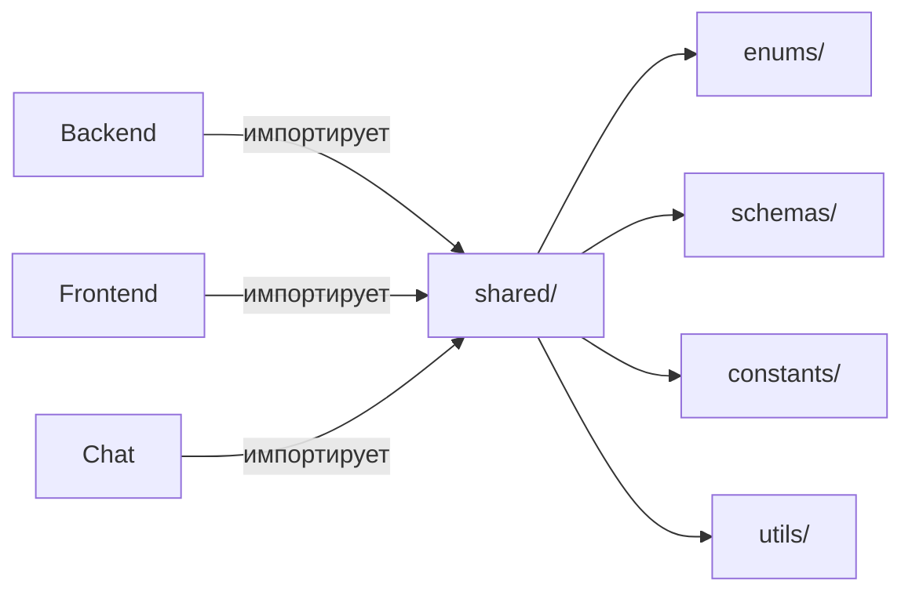

# Shared

`src/shared/` — слой общих контрактов между бекендом и фронтендом.

Любой тип, который используется и бекендом, и фронтендом, живёт здесь. Никакой бизнес-логики — только перечисления, транспортные схемы и константы.

## Структура

| Папка | Назначение |
|-------|-----------|
| `enums/` | StrEnum-перечисления: домены, предметы, инвентарь, статы, навыки, онбординг |
| `schemas/` | Pydantic-схемы транспортного слоя (бек → фронт) |
| `constants/` | Константы проекта |
| `utils/` | Dev-утилиты |

## Правило импорта

Код из `src/shared/` импортирует **только** другой код из `src/shared/`. Никаких обратных зависимостей на `features/`, `infrastructure/` или `frontend/`.
