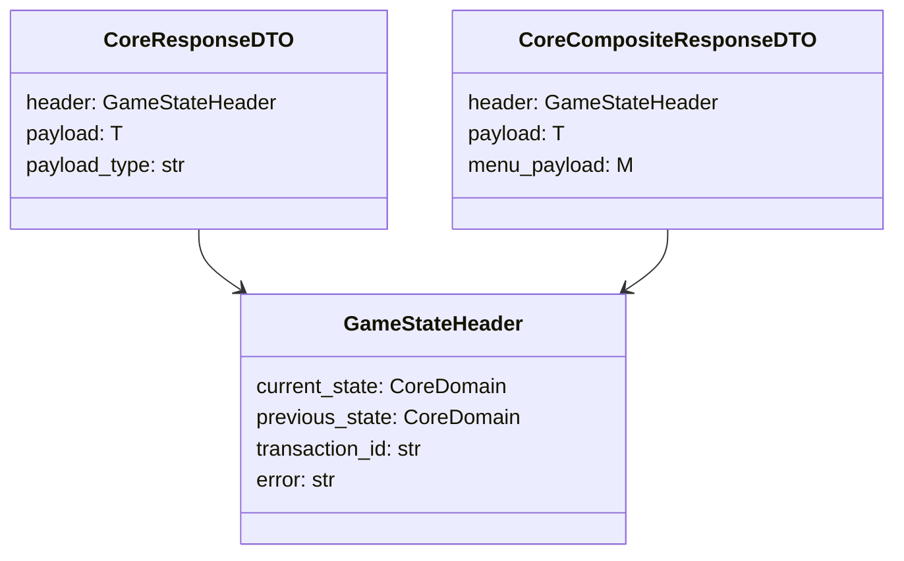
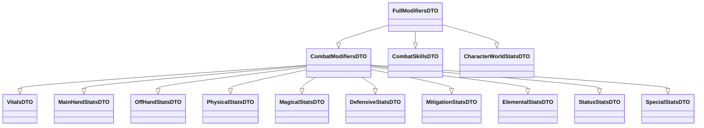

# Schemas

`src/shared/schemas/` — Pydantic-схемы транспортного слоя. Это контракт между бекендом и фронтендом: бекенд сериализует ответы в эти схемы, фронтенд их десериализует.

## Транспортные конверты

Все ответы бекенда оборачиваются в `CoreResponseDTO` или `CoreCompositeResponseDTO`. `GameStateHeader` всегда присутствует и сообщает фронтенду куда переключить UI.

::: shared.schemas.response.GameStateHeader
    options:
      show_source: false
      show_root_heading: false

::: shared.schemas.response.CoreResponseDTO
    options:
      show_source: false
      show_root_heading: false

::: shared.schemas.response.CoreCompositeResponseDTO
    options:
      show_source: false
      show_root_heading: false

::: shared.schemas.response.StateTransitionDTO
    options:
      show_source: false
      show_root_heading: false

::: shared.schemas.response.ServiceResult
    options:
      show_source: false
      show_root_heading: false

---

## Account Context

`AccountContextDTO` — Redis-снэпшот персонажа (`ac:{char_id}`). Читается при каждом запросе фронтенда для быстрого доступа к состоянию без обращения к БД.

::: shared.schemas.account_context.AccountContextDTO
    options:
      show_source: false
      show_root_heading: false

---

## Персонаж

::: shared.schemas.character.CharacterReadDTO
    options:
      show_source: false
      show_root_heading: false

::: shared.schemas.character.CharacterStatusDTO
    options:
      show_source: false
      show_root_heading: false

::: shared.schemas.character.CharacterAttributesReadDTO
    options:
      show_source: false
      show_root_heading: false

---

## Модификаторы

`CombatModifiersDTO` — полный набор боевых характеристик актора. Собирается из нескольких атомарных блоков через множественное наследование.

::: shared.schemas.modifier_dto.CombatModifiersDTO
    options:
      show_source: false
      show_root_heading: false

::: shared.schemas.modifier_dto.FullModifiersDTO
    options:
      show_source: false
      show_root_heading: false

::: shared.schemas.modifier_dto.CharacterWorldStatsDTO
    options:
      show_source: false
      show_root_heading: false

---

## Боевые схемы (фронтенд-контракт)

`CombatDashboardDTO` — главный снимок экрана боя, отдаётся фронтенду на каждый poll/push.

::: shared.schemas.combat.CombatDashboardDTO
    options:
      show_source: false
      show_root_heading: false

::: shared.schemas.combat.CombatActorCardDTO
    options:
      show_source: false
      show_root_heading: false

::: shared.schemas.combat.CombatEventDTO
    options:
      show_source: false
      show_root_heading: false

::: shared.schemas.combat.CombatResultDTO
    options:
      show_source: false
      show_root_heading: false

---

## Сообщения

`GameMessageDTO` — универсальный контракт для чата и системных сообщений. Channel определяет вкладку, tab описывает её поведение.

::: shared.schemas.messages.GameMessageDTO
    options:
      show_source: false
      show_root_heading: false

::: shared.schemas.messages.GameMessageTabDTO
    options:
      show_source: false
      show_root_heading: false

---

## Panel

`PanelDTO` — универсальный виджет-контейнер для UI-панелей (статус персонажа, детали предмета и т.д.).

::: shared.schemas.panel.PanelDTO
    options:
      show_source: false
      show_root_heading: false

::: shared.schemas.panel.PanelWidgetDTO
    options:
      show_source: false
      show_root_heading: false

---

## Ошибки

::: shared.schemas.errors.ErrorResponse
    options:
      show_source: false
      show_root_heading: false
